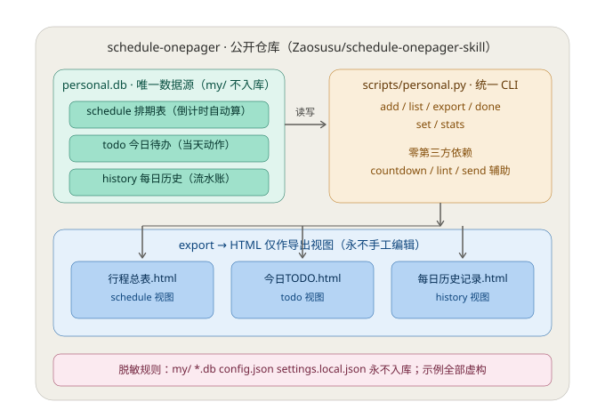

# 行程表skill · 一页纸排期表 · Schedule Onepager

> 一页纸行程表 + 独立每日 TODO 维护 skill。两种模式互不合并、互不读取。

把零散进来的行程信息归档成**一张**能直接在邮箱里看的 HTML 表。**这张表只回答一个问题：哪几天被占用了。**

给同时被多个活动、项目、课程占用档期的人用：信息从群公告截图、海报、赛事须知、临时约谈里零散进来，你需要一个地方一眼看清自己接下来哪几天走不开。

## 为什么是「一张表」而不是日历应用

| | 日历应用 | 这个 skill |
|---|---|---|
| 录入 | 一条一条手填，字段固定 | 把截图/公告丢给 AI 助手，它归档 |
| 一个 5 天的活动 | 5 个事件，或一个看不见细节的长条 | **一行**，内部细分写在「事项」列 |
| 想快速扫一遍 | 要翻月视图、点进详情 | 一屏看完，颜色分活动，倒计时排优先级 |
| 在手机上看 | 要装 app、要同步 | **一封邮件**，收件箱里翻出来就是 |
| 归档 | 在别人的云上 | 一个 HTML 文件，在你自己盘上 |

代价是它**不提醒、不同步、不订阅**。它不是日历的替代品，是日历之外那张「我的档期总览」。

## 表长什么样


## 还有个「每日 TODO」模式（和排期表分开）

排期表管「哪几天被占用了」，TODO 管「今天动手做什么」。它是**另一个文件** `my/todo.html`，只装当天可勾选的动作项，不和排期表互相读取、也不从排期表自动搬条目。

三列：状态（待办 / 进行中 / 已完成）/ 任务 / 备注。每天刷新表头日期、把过期的标灰。发邮件同样复用 `scripts/send_schedule.py my/todo.html`，也只有说「发」才发。

```bash
cp template/todo.template.html my/todo.html
```

跑 `examples/todo-demo.html` 看渲染效果（任务全部虚构）。

## 还有个「每日历史记录」模式（排期表 / TODO 之外）

排期表管「未来哪几天被占」，TODO 管「今天动手做什么」，历史记录管「每天**做了什么**」——三张表各管各的，互不读取。

历史记录用 **SQLite**（`scripts/history.py` + `daily_history.db`），不走手写 HTML：HTML 只是 `export` 出来的浏览视图，追加永远走命令。好处是记录会一直累加也不乱，还能 `stats` 按日期/分类复盘。

```bash
python scripts/history.py add --date 2026-08-18 --cat 项目A --text "完成需求评审"
python scripts/history.py list                 # 最近 20 条
python scripts/history.py stats                # 按日期+分类计条数
python scripts/history.py export               # 生成 每日历史记录.html
```

DB 路径自动解析：`--db` > 环境变量 `DAILY_HISTORY_DB` > 脚本同目录的 `daily_history.db` > `<skill根>/my/daily_history.db`。把自己 cp 到工作目录用时，自动命中同级的库。示例见 `examples/history-example.md`（数据全部虚构）。

## 三条设计判断

**0. 统一数据层。** 三种数据全部落在**同一个 SQLite 库（personal.db）的三张表里**（schedule / todo / history），由一个 CLI（`scripts/personal.py`）统一管理；HTML 只是 `export` 出的视图，永不手工编辑。



**1. 一张表，原地覆盖。** 数据文件只有一个。不建副本、不建草稿、不按活动拆分——多一份就会有一份是过期的，而你不知道是哪一份。

**2. 表要干净，对话可以不干净。** 表里只有六列。食宿建议、订票提醒、行前清单、冲突风险分析**都不进表**，它们会把「哪几天被占了」这个信号淹掉。但 AI 助手在**回话里**该提醒的照样提醒。这个分工是这个 skill 最容易被做错的地方。

**3. 时间状态会腐烂。** 倒计时、已完成灰底、表头日期全都随时间失效。所以规则是：**任何一次动表都要重算全表的时间状态**，不能只改被提到的那一行。`scripts/lint_schedule.py` 就是为了逮住这一条。

## 快速上手

```bash
git clone https://github.com/Zaosusu/schedule-onepager-skill.git
cd schedule-onepager-skill

# 建自己的私有副本（my/ 已在 .gitignore 里）
mkdir -p my
cp template/schedule.template.html my/schedule.html
cp config.example.json my/config.json

# 改 my/config.json：identities 换成你自己场景该有的身份词
# 然后把行程丢给 AI 助手，让它填 my/schedule.html
```

算星期和倒计时（**不要心算**）：

```bash
python scripts/countdown.py --today 2026-03-09 2026-03-14 2026-04-02
# today = 2026-03-09 Mon(1)
# 2026-03-14  Sat(6)   D-5    <-- WEEKEND
# 2026-04-02  Thu(4)   D-24
```

公告只写了「8月21日（周五）」没写年份，或者年份和星期对不上：

```bash
python scripts/countdown.py --which-year 08-21
# 2025-08-21  Thu(4)
# 2026-08-21  Fri(5)   ← 星期对得上的是这一年
```

发之前自查：

```bash
python scripts/lint_schedule.py my/schedule.html
```

`examples/` 和 `template/` 里的文件表头日期是**故意冻结**的，linter 会自动跳过「表头是否是今天」这一项并打一行 INFO 说明原因 —— 所以照着 README 试跑示例不会看到假报错。把它们复制到 `my/` 之后检查自动恢复；想在原地强制检查加 `--strict-date`。

发到自己邮箱（授权码走环境变量，不落盘）：

```bash
SMTP_USER='you@example.com' SMTP_PASS='<授权码>' \
  python scripts/send_schedule.py my/schedule.html
# 不确定参数对不对，先加 --dry-run
```

各家邮箱怎么开 SMTP、怎么拿授权码，见 `references/smtp-setup.md`。

## 跟 AI 编程助手一起用

这个仓库本身就是一个 skill。拷进助手的 skill 目录：

```bash
cp -r schedule-onepager-skill ~/.claude/skills/schedule-onepager/       # 全局
# 或
cp -r schedule-onepager-skill .claude/skills/schedule-onepager/         # 只在某个项目里
```

之后你直接说人话就行：

- 「这是群里发的赛事须知（截图），加到我的排期里」
- 「9 月那个改到 10 月 8 号了」
- 「更新一下排期」
- 「发」 ← **只有说这个字才会发邮件**

助手会照 `SKILL.md` 的规则办：只收录已确定日期的事、一个连续档期一行、每次动表重算全表时间状态、不主动发邮件。

## 目录

```
SKILL.md                          # 给 AI 助手看：7 条硬规则 + 收到新信息的处理流程
README.md                         # 给人看：就是这份
config.example.json               # 身份词表 / 配色池 / 数据文件路径 / SMTP 环境变量名
template/
  schedule.template.html          # 空骨架，每列都有注释说明怎么填
  todo.template.html              # 每日 TODO 空骨架（独立文件，只装当天）
examples/
  schedule-demo.html              # 填满的示例（人、活动、机构、电话、邮箱全部虚构）
  todo-demo.html                  # 每日 TODO 填满示例（任务全部虚构）
references/
  email-html.md                   # 邮件客户端 HTML 硬约束 + 自查清单
  smtp-setup.md                   # QQ/163/Gmail 授权码怎么拿，报错对照表
scripts/
  countdown.py                    # 星期 + 倒计时计算；--which-year 用星期反推年份
  lint_schedule.py                # 发之前自查：邮件兼容性 + 表头日期是否过期
  send_schedule.py                # 读环境变量发 HTML 正文邮件（无附件）
  history.py                      # 每日历史记录：SQLite 存每天做了什么，HTML 仅作导出视图
my/                               # 你自己的表和配置，已 gitignore，仓库里不存在
LICENSE                           # MIT
```

## 身份词表是「示例」，不是规定

`config.example.json` 里给的是一组示例：

```
顾问 ⊃ 评委 · 老师 · 选手 · 主导
```

**换成你自己场景该有的词。** 真正重要的是机制，不是这几个字：

- 词表必须**封闭**——同一种身份出现三种写法，表就不能一眼扫完了
- 归不进任何一个词时**问，不要造词**
- 词之间有包含关系时（示例里顾问有资格兼任评委），**写更高的那个**，写低的等于降级

配色同理：`palette` 是候选色池，一个活动占一组，同活动所有行同色，新活动取下一组未占用的色并同步图例。不要把颜色和具体活动写死。

## 已知限制

- **表宽固定 760px，手机端要横向滑动。** 这是当前最明显的短板。想做窄屏版的方向写在 `references/email-html.md` 里，但邮件客户端对 media query 支持参差，别指望响应式
- **只在 QQ 邮箱（桌面网页版 + 手机客户端）实测过。** Gmail / Outlook / 网易系遵循同一套约束通常没问题，但**没实测**，出问题请开 issue
- **`lint_schedule.py` 不验证倒计时对不对。** 它只把找到的日期和倒计时并排打出来给你核。要真验证得解析表格语义，一个半吊子的解析器悄悄放过一张错表比没有解析器更糟
- **没有测试。** 三个脚本都靠手跑
- **没有自动刷新。** 「重算全表时间状态」这条靠 AI 助手自觉 + linter 逮，不是脚本强制的
- **不提醒、不同步、不生成 .ics。** 见开头那张对比表

## 架构：skill 本体与个人数据分离

本仓库同时装两种东西，靠 `.gitignore` 硬隔离：

```
skill 本体（可 push / 可公开分享）        个人数据（永不 push）
├── SKILL.md  README.md  LICENSE          my/（整个目录被忽略）
├── scripts/  template/  examples/        ├── personal.db（排期 + TODO + 历史）
├── references/  docs/  config.example.json│   ├── 行程总表.html / 今日TODO.html
└── config.json（示例，忽略真实配置）      │   └── 每日历史记录.html / 个人素材
                                          └── 一切你的真实信息
```

- **日常用**：数据只写 `my/`（`python scripts/personal.py ...`），本地私有
- **发布**：只 push skill 本体；push 前跑 `git status` 确认没有 `my/`、`*.db`、`config.json`、`settings.local.json`，再 `git commit` + `git push`
- 规则细节见 SKILL.md「发布 / 脱敏 push 流程」章节

## 隐私

- `my/` 和 `config.json` 在 `.gitignore` 里，个人行程和配置不会被提交
- `daily_history.db`（无论落在 `my/` 还是工作目录）是个人流水账，绝不进仓库
- 授权码**只走环境变量**，仓库里任何文件都不存
- `examples/schedule-demo.html` 里的人、活动、机构、电话、邮箱、地点**全部虚构**
- 排期表本身是敏感信息：它写明了你哪几天不在家。往外发之前想一下发给谁

## 许可

MIT，见 `LICENSE`。
